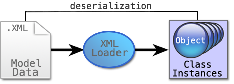
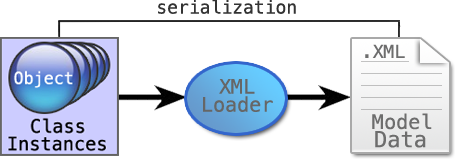

----------
# GAXB
----------

##### What is it good for?
Rather than writing out all of the classes in your desired language, you can instead build an XML schema. Then, instead of initializing model objects in code, you can write XML that conform to that schema. When your project is compiled, GAXB generates the code for your classes and code for the serializer and deserializer needed to convert those objects to XML and vice-versa.

##### What is it?

GAXB (Generic Architecture XML Bindings) is an XML schema-based code generation tool that supports custom cross-language model data serialization and deserialization.

GAXB supports custom lua script templates and is fully serializable, model data can be used to generate XML (serializing) and XML can be used to generate model data (deserializing).

##### How does it work?

---

###### Compile time code generation:

During compile time GAXB generates the header and implementation files for all of the elements defined in your schema. These generated classes contain their own serialization methods. GAXB also generates an XML Loader for deserializing objects from your XML files.


---

###### Run time deserialization:

During run time you can use the XML Loader to read in your XML files, which deserializes them into class instance objects that can then be manipulated in your application code.



---

###### Run time serialization:

Conversely, any class objects you create in your application code can be serialized to XML files for later use.



---

# Examples
----------

### Schema Example:
This schema defines the structure of our Galaxy data model.  This snippet shows the structure that a Planet will conform to.

You can [view the full schema file here](galaxy_schema.md).
<pre><code>&lt;!-- Galaxy.xsd --&gt;
&lt;schema xmlns="http://www.w3.org/2001/XMLSchema"
    xmlns:ga="http://schema.smallplanet.com/Galaxy"
    targetNamespace="http://schema.smallplanet.com/Galaxy"&gt;
    
    ... (other element definitions) ...
    
    &lt;!-- Planet --&gt;
    &lt;element name="Planet" type="ga:Planet"/&gt;
    &lt;complexType name="Planet"&gt;
        &lt;complexContent&gt;
            &lt;extension base="ga:AstronomicalObject"&gt;
                &lt;sequence&gt;
                    &lt;element ref="ga:Moon" minOccurs="0" maxOccurs="unbounded" /&gt;
                &lt;/sequence&gt;
                &lt;attribute name="hasRings" type="boolean" default="false" /&gt;
            &lt;/extension&gt;
        &lt;/complexContent&gt;
    &lt;/complexType&gt;

	...
    
&lt;/schema&gt;
</code></pre>

### XML Example:
This XML file conforms to the **Galaxy.xsd** schema and defines a Star System with one Planet that has a Moon.

Our very own system, the Solar System, [might look like this](solar_system.md).
<pre><code>&lt;?xml version="1.0" encoding="utf-8" ?&gt;
&lt;StarSystem xmlns="http://schema.smallplanet.com/Planets"&gt;
    
    &lt;Planet name="Planet X" mass="1" hasRings="false"
        &lt;Moon name="Moon Y"/&gt;
    &lt;/Planet&gt;

&lt;/StarSystem&gt;
</code></pre>


### Generated Base Class Example:
Base classes are generated from the schema by GAXB during compile time. These base classes will be re-generated any time a change is made to that object in the schema.

The following code is the generated Galaxy_PlanetBase Objective C header file. This is one of the generated code files that results from compiling an Objective C project using the **Galaxy.xsd** schema.
<pre><code>// Galaxy_PlanetBase.h
// Autogenerated by gaxb at 10:21:03 AM on 01/01/13

@class Galaxy_Moon;
@interface Galaxy_PlanetBase : Galaxy_AstronomicalObject
{	
    // Attributes
    BOOL hasRings;
    BOOL hasRingsExists;

    // Subelements
    NSMutableArray *Moons;
}

@property (nonatomic) BOOL hasRings;
@property (nonatomic,readonly) BOOL hasRingsExists;
@property (nonatomic,retain) NSMutableArray * Moons;

- (NSString *) hasRingsAsString;
- (void) setHasRingsWithString:(NSString *)string;

@end
</code></pre>

### Custom Code Example:
Along with each generated base class, GAXB also generates header and implementation file stubs that subclass their base-class.  These classes are only generated once and are used to write your custom logic.

Here is the generated and ready-to-use implementation file stub for Galaxy_Planet, which extends Galaxy_PlanetBase.
<pre><code>// Galaxy_Planet.mm
// Autogenerated by gaxb at 10:21:03 AM on 01/01/13
#import "Galaxy_Planet.h"

@implementation Galaxy_Planet

// Write your custom Galaxy_Planet object logic.

@end
</code></pre>

The GAXB repository contains a fully-functional Objective-C project based on these examples. Follow the installation instructions in the next section and take a look at the BigPlanets example project.

---
# Installation
----------

#### Installation Prerequisites
In order to install GAXB, your system will require git, CMake 2.8, libxml2, and a compiler tool-chain.

Install git from their <a href="https://help.github.com/articles/set-up-git">setup page</a>.

Install brew from the <a href="http://mxcl.github.io/homebrew/">Homebrew Page</a> so we can install cmake.

To install cmake for **Mac OS X**:

```bash
brew update
brew install cmake
```

To install cmake, a tool-chain, and libxml2 on **Linux**:

```bash
apt-get install build-essential
apt-get install cmake
apt-get install libxml2-dev
```

#### GAXB Installation
Now you can clone the repository:

```bash
git clone -b cmake git://github.com/SmallPlanet/gaxb.git
cd gaxb
git submodule update --init lua
```

Then build it using cmake:

```bash
mkdir build && cd build
cmake ..
make
```

The executable (gaxb) will be waiting for you in the current directory!

### Command Line Usage

There is a sample.xsd schema in the **Examples/Sample** directory that you can build from the command line. Try the following in that directory:

```bash
mkdir Generated
../../build/gaxb objc sample.xsd -t ../../templates -o Generated
```

This will generate some quick Objective-C classes in **Generated/** based on the schema at **sample.xsd**.

### IDE Usage

A sample XCode project for an iOS app using gaxb-generated classes is included in **Examples/BigPlanet**. Open **BigPlanet.xcodeproj** from that directory in XCode, select iPhone or iPad Simulator, then Build and Run. This simple example uses the schema located at **XMLSchema/Planets.xsd** and loads sample data from **BigPlanets/sol.xml**.  

----------

## License

Copyright (c) 2012 Small Planet Digital, LLC

Permission is hereby granted, free of charge, to any person obtaining a copy of this software and associated documentation files (the "Software"), to deal in the Software without restriction, including without limitation the rights to use, copy, modify, merge, publish, distribute, sublicense, and/or sell copies of the Software, and to permit persons to whom the Software is furnished to do so, subject to the following conditions:

The above copyright notice and this permission notice shall be included in all copies or substantial portions of the Software.

THE SOFTWARE IS PROVIDED "AS IS", WITHOUT WARRANTY OF ANY KIND, EXPRESS OR IMPLIED, INCLUDING BUT NOT LIMITED TO THE WARRANTIES OF MERCHANTABILITY, FITNESS FOR A PARTICULAR PURPOSE AND NONINFRINGEMENT. IN NO EVENT SHALL THE AUTHORS OR COPYRIGHT HOLDERS BE LIABLE FOR ANY CLAIM, DAMAGES OR OTHER LIABILITY, WHETHER IN AN ACTION OF CONTRACT, TORT OR OTHERWISE, ARISING FROM, OUT OF OR IN CONNECTION WITH THE SOFTWARE OR THE USE OR OTHER DEALINGS IN THE SOFTWARE.

## Enjoy!
